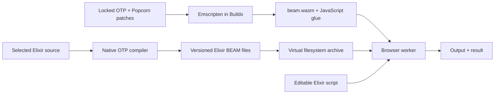

# How Elixir reaches the browser

Elixir compiles to BEAM bytecode. A normal installation executes that bytecode in the Erlang/OTP virtual machine. This builder compiles the VM's C implementation to WebAssembly and packages the chosen Elixir compiler and standard library as bytecode. It does not translate Elixir expressions directly into standalone Wasm functions.

The native OTP executable is a build tool. Only the Wasm executable runs in the browser. The selected Elixir compiler also runs in that browser VM, enabling `Code.eval_string/3` and new module definitions without a compilation server.

## Two upstream approaches

[AtomVM](https://github.com/atomvm/AtomVM) implements a smaller BEAM interpreter with a subset of OTP's facilities. Its Emscripten port supports browsers and Node. Popcorn 0.3 builds on a modified AtomVM and patches standard libraries for that environment.

[Popcorn's newer OTP port](https://github.com/software-mansion/popcorn/tree/bea24dd50fec39a5859e49c54d496736a3c6857a/popcorn) instead patches Erlang/OTP itself. This builder uses that exact patch stack with OTP 29.0.6. It is prerelease upstream work. It gives a useful browser baseline but does not make historical Elixir versions compatible with OTP 29 automatically.

The catalogue deliberately separates three identities: Elixir source version, the OTP version used to produce bytecode, and the browser VM version. A version dropdown must choose a matching bundle rather than relabel one modern interpreter.

## Build stages and caching

Buildx caches the shared SDK, native tools and VM independently of Elixir version selection. `browser-artifacts` exports files from a scratch stage; the output is a static bundle, not a Linux container that the browser runs. Docker's `linux/arm64` or `linux/amd64` identifies the build host. Emscripten chooses the WebAssembly target.

The source archives and container images are pinned. Apt build dependencies are still resolved from package repositories. These controls provide traceable inputs; bit-for-bit reproducibility needs independent rebuild comparisons.
