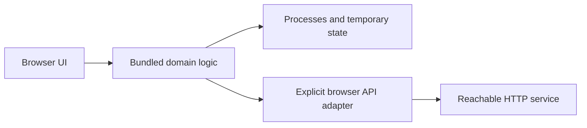

# What changes when you bundle a project

A script needs the selected Elixir compiler and its standard library. A Mix project adds application metadata, transitive dependencies, startup configuration and often files under `priv/`. A reliable bundle preserves those requirements deliberately.

Pure Elixir and Erlang modules are usually the easiest starting point. A GenServer can still own state and exchange messages inside the browser VM. A server application's external resources need a new boundary: the browser cannot open a PostgreSQL TCP connection, launch a shell command or load a native shared library from the host machine.

Extract a small computational component before attempting a whole Phoenix release. Keep authentication secrets and privileged database access on a trusted server. Browser JavaScript can supply user-selected files and make permitted HTTP requests, but those are explicit adapters rather than ordinary server socket calls.

Dependencies must be assessed at runtime, not just by whether `mix compile` passes. A dependency may compile but later call `System.cmd/3`, a NIF, a socket API, or a missing optional application. Dynamic module loading also means static dependency inspection can miss requirements.

The tutorial's local dependency demonstrates a fully bundled module boundary without a package service at runtime. For third-party dependencies, preserve `mix.lock`, compile with the selected Elixir/OTP pair, include the required application closure, and test the actual feature path in a browser.

`priv/` assets and configuration deserve their own checks. A precompiled `.beam` file does not automatically carry adjacent templates, data files or runtime environment settings. Treat your package's filesystem and startup configuration as an interface.
