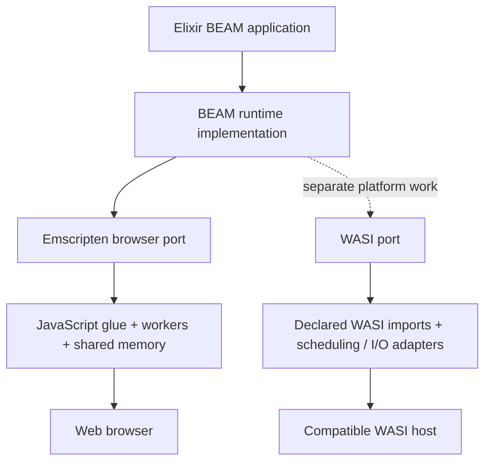

# Browser WebAssembly and WASI need different host contracts

WebAssembly defines the executable format and virtual instruction set. The WebAssembly System Interface (WASI) defines interfaces a Wasm module can import from its host. A browser can execute Wasm without implementing WASI. A WASI host cannot supply arbitrary Emscripten JavaScript imports merely because a filename ends in `.wasm`.

The selected OTP port uses Emscripten pthread support, workers, filesystem emulation and a JavaScript bridge. Some imports may use WASI-like names internally, but the complete import set and lifecycle still require Emscripten. Node execution of an Emscripten build would be another JavaScript host configuration, not evidence of WASI compatibility.

## The separate WASI work

A real WASI backend needs an identified interface version, a scheduler model, clocks and timers, file-descriptor rights, random data, memory/thread support and explicit answers for unavailable sockets and native extensions. WASI Preview 1 and the component-model interfaces are also distinct contracts.

The separate [AtomVM WASI port](wasi.md) now implements a Preview 1 command profile. The CLI selects it with `--backend atomvm --target wasi`; direct OTP and Popcorn still reject WASI requests. The lab exposes host downloads independently of browser execution.

The WASI acceptance criteria are concrete: inspect the Wasm import set; run an Elixir version probe, arithmetic, message passing and file I/O in a named WASI host; verify denied filesystem access; and record hashes plus host version. Preserve those results separately from browser evidence.

See the [WASI design principles](https://github.com/WebAssembly/WASI/blob/main/docs/DesignPrinciples.md), [Wasmtime tutorial](https://github.com/bytecodealliance/wasmtime/blob/main/docs/WASI-tutorial.md), and [current target reference](../reference/targets.md).
